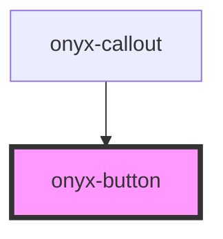

# onyx-button

<!-- Auto Generated Below -->

## Properties

| Property  | Attribute | Description | Type                                                           | Default     |
| --------- | --------- | ----------- | -------------------------------------------------------------- | ----------- |
| `size`    | `size`    |             | `string`                                                       | `"medium"`  |
| `variant` | `variant` |             | `"disabled" \| "error" \| "neutral" \| "success" \| "warning"` | `"neutral"` |

## Events

| Event     | Description | Type               |
| --------- | ----------- | ------------------ |
| `clicked` |             | `CustomEvent<any>` |

## Dependencies

### Used by

 - [onyx-callout](../onyx-callout)

### Graph

----------------------------------------------

*Built with [StencilJS](https://stenciljs.com/)*
