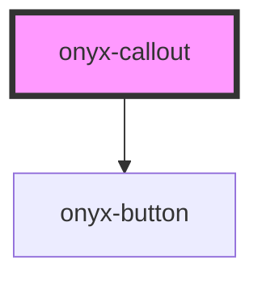

# onyx-callout

<!-- Auto Generated Below -->

## Properties

| Property      | Attribute      | Description | Type                                             | Default     |
| ------------- | -------------- | ----------- | ------------------------------------------------ | ----------- |
| `actionTitle` | `action-title` |             | `string`                                         | `'default'` |
| `actionType`  | `action-type`  |             | `string`                                         | `undefined` |
| `header`      | `header`       |             | `string`                                         | `undefined` |
| `type`        | `type`         |             | `"error" \| "neutral" \| "success" \| "warning"` | `'neutral'` |

## Dependencies

### Depends on

- [onyx-button](../onyx-button)

### Graph

----------------------------------------------

*Built with [StencilJS](https://stenciljs.com/)*
