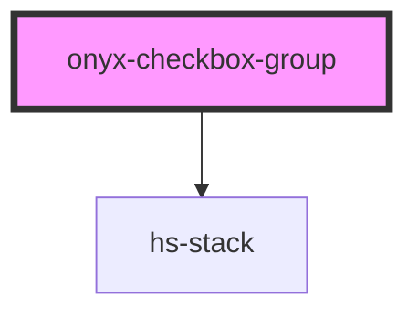

# onyx-checkbox-group

<!-- Auto Generated Below -->

## Properties

| Property         | Attribute         | Description                                                                                               | Type                                                                       | Default      |
| ---------------- | ----------------- | --------------------------------------------------------------------------------------------------------- | -------------------------------------------------------------------------- | ------------ |
| `name`           | `name`            | Unique name to group these options under. Child check boxes must feature the same `name` attribute value. | `any`                                                                      | `undefined`  |
| `orientation`    | `orientation`     | Determines if the check boxes will display stacked vertically or horizontally. See {@link Orientation}    | `"horizontal" \| "horizontal-reverse" \| "vertical" \| "vertical-reverse"` | `'vertical'` |
| `selectedValues` | `selected-values` | Default selected value, which will check the matching checkbox element(s).                                | `any`                                                                      | `undefined`  |

## Dependencies

### Depends on

- [hs-stack](../hs-stack)

### Graph

----------------------------------------------

*Built with [StencilJS](https://stenciljs.com/)*
