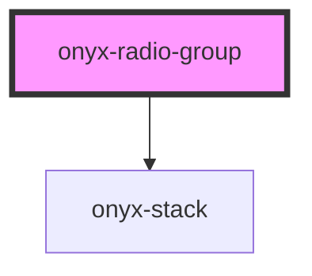

# hs-radio-group


<!-- Auto Generated Below -->


## Overview

The `<onyx-radio-group />` component is a wrapper for `<onyx-radio />` child components
and can be rendered on either horizontal or vertical layouts. The component needs to
be annotated with a `name` attribute that has to be replicated in all its children.

### Example
```html
<onyx-radio-group name="my-input" selected-value="5">
  <onyx-radio name="my-input" value="1">Option 1</onyx-radio>
  <onyx-radio name="my-input" value="2">Option 2</onyx-radio>
  <onyx-radio name="my-input" value="3">Option 3</onyx-radio>
  <onyx-radio name="my-input" value="4">Option 4</onyx-radio>
  <onyx-radio name="my-input" value="5">Option 5</onyx-radio>
</onyx-radio-group>
```

## Properties

| Property        | Attribute        | Description                                                                                                                       | Type                                                                       | Default      |
| --------------- | ---------------- | --------------------------------------------------------------------------------------------------------------------------------- | -------------------------------------------------------------------------- | ------------ |
| `name`          | `name`           | Unique name to group these options under. Child radio inputs must feature the same `name` attribute value.                        | `any`                                                                      | `undefined`  |
| `orientation`   | `orientation`    | Based in the `Orientation` ambient type, will display the radio group stacked vertically or horizontally. See {@link Orientation} | `"horizontal" \| "horizontal-reverse" \| "vertical" \| "vertical-reverse"` | `'vertical'` |
| `selectedValue` | `selected-value` | Default value, which will preselect the matching radio element.                                                                   | `any`                                                                      | `null`       |


## Dependencies

### Depends on

- [onyx-stack](../onyx-stack)

### Graph


----------------------------------------------

*Built with [StencilJS](https://stenciljs.com/)*
